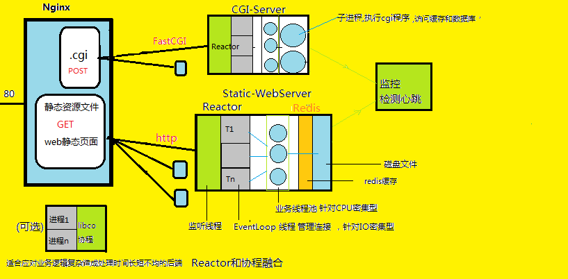

### 介绍
 
<a href="https://zlonqi.gitee.io/2020/02/11/lonky-pretty-server/"></a>

#### [关键词]
> Excellent performance and concurrency  
> **web、CGI**、**nginx/redis/mysql**、singleton long connection  
> **http1.1 GET/POST/Pipeline**、**fastcgi**、sigleton encoder&decoder  
> **thread-heartbeat**、**websocketd**、**prometheus+alertmanager+grafana+dingtalk** 联合监控  

#### [架构]

  

> **PS**:重点在上游的web静态和FastCGI服务器集群 -- 它们是无状态的服务，就没有考虑主从复制、存储分片、网络分区、容错、故障恢复和共识选主等有状态服务的高可用保障的设计。<a href="https://www.yuque.com/longky/btxa2q/rus66z">***【系统设计理解】*** <a>

#### [业务]

> 流程: 主页->空间->登陆->注册(各种checker)->登陆->登陆成功(y/n)

#### [压测]

 *QPS > 36K req/s，吞吐量 >40MB/s, 响应时长 3.6ms(99%)* <a href="https://www.yuque.com/longky/gw0h0i/ulipsg">***【压测报告】*** <a>

#### [难点] 
<a href="https://www.yuque.com/longky/xx7ivw/bsflrs">***【性能调优】*** <a>
<a href="https://zlonqi.gitee.io/2021/02/22/note/">***【项目中遇到的难点】***</a>

### 更多

##### [用法]

```bash
cd bin
./run
./cgiServer ~/PATH/fastcgi/config.yaml 
./HeartBeatChecker
```

##### [配置]
###### ~/bin/config.yaml <a href="https://www.yuque.com/longky/gw0h0i/xeglug">***配置详解***</a>
###### ~/cgiServer/config.yaml
##### [说明]
```
0、epoll+reactor构成IO模块，threadpool负责业务处理和计算
1、文件采用分块发送策略，保证了所需的发送缓冲区和文件大小无关，极大节约内存资源
2、忽略SIGPIPE，对SIGINT\SIGTERM设置回调函数，保证整个服务器能够安全有序地终止和析构
3、redis连接是线程单例的长连接，该连接和心跳一样，都能自行断线重连，自动切换，可靠可用
4、redis：MD5(path+filename)作为key，ZIP(file)作为value，md5和zip编解码器均为线程单例
5、为每个连接生成全局唯一的requestID，于进入函数体伊始打印log时附上此requestID，有利于日志分析和程序排错
6、g++开启 -fsanitize=address -g 以检测内存问题、shell打开生成coredump有利于多线程程序复现崩溃现场环境
7、CPU性能分析工具--perf+火焰图，找出性能瓶颈
8、linux内核参数调优应适需求进行
```

##### [代码统计]

<a href="https://www.yuque.com/longky/gw0h0i/gzx302">***cloc***</a>

##### [Related work]
> github.com/redis  
> github.com/nginx   
> github.com/chenshuo/muduo  
> github.com/tencent-wechat/libco  
> github.com/joewalnes/websocketd  
> github.com/LMAX-Exchange/disruptor  
> github.com/EZLippi/Tinyhttpd  
> github.com/F-Stack/f-stack  
> github.com/DPDK/dpdk  
> http://seastar.io  


### 接下来
###### CPU affinity、平滑更新、接口拨测、弹性线程池、改进请求处理的优先级调度算法
###### 探索C10M方案 ：Share-nothing、lock-free、cache affinity、kernel bypass、zero-copy、asynchronous programming

### 致谢
> 每一位开源贡献家的杰出作品，得以让后来者学习优秀的设计原则和工程规范。仓库会在校招结束后全量开源和长期维护，遵守<a href="http://www.ruanyifeng.com/blog/2011/05/how_to_choose_free_software_licenses.html">MIT license</a>.
##### <a href="https://zlonqi.github.io">***关于后浪***</a>

