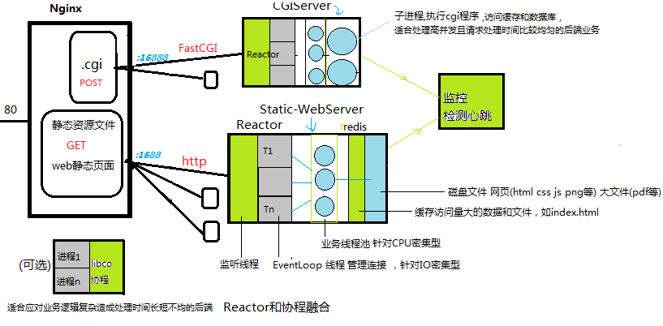
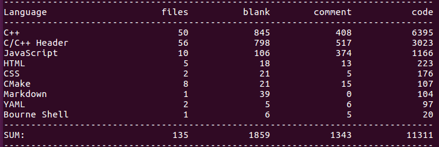
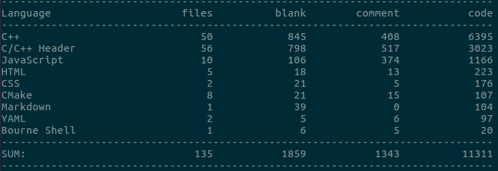

### 简述

> linux c++多线程、高性能，高可靠，高可用，可维可测
>
> 

##### [核心]

> **静态资源服务器、FastCGI服务器、心跳监控服务器**  
> IO Model **Reactor+threadPool**, 传输协议为 **http1.1/fastcgi**, 涉及 **nginx/redis/mysql**  
> 主机cpu/mem/IO监控使用**websocketd**、线程监控基于**心跳和日志**  


##### [架构图]

  


**Note**:libco仅作为可选的方案之一，Reactor和协程的融合也值得探讨

<a href="https://zlonqi.gitee.io/2020/02/11/lonky-pretty-server/">[video]</a>

##### [业务]

> 业务流程: 主页->注册(各种checker)->登陆->登陆成功(y/n)

##### [压测]

> 在单台多核主机上，IO线程size=2，业务线程池size=5，用wrk和apache ab分别压index.html(2kB)：
> (不连接redis)

```shell
ab -k -c 100 -n 10000 http://127.0.0.1:1688/
 ./wrk -t3 -c100 -d10s -H "Connection: keepalive" "http://localhost:1688/"
```

> 压测结果***QPS > 36000 req/s，吞吐量 >40MB/s, 响应时长 3ms(90%)***

##### [Detail]

> 1、redis connection是**线程单例的长连接，redis 连接崩溃不会波及自身，自行断线重连，具有强悍的可靠性、可用性**（心跳连接也一样，充分地进行了解耦，自行断线重连)  
> 2、redis缓存的key是path+filename用md5编程固定长度的串，value是文件进行zip压缩后的内容，**md5和zip编解码器均为线程单例对象**  
> 3、响应请求发送文件采用**分块发送**，所以所需的发送缓冲区大小只与连接数有关，和文件大小无关  
> 4、对**SIGPIPE**采取忽略，对**SIGINT\SIGTERM**设置回调函数，使整个服务器能够安全有序地终止和析构  
> 5、每个连接生成一个全局的**requestID**，打印日志时带上这个。日志在刚进入函数体时就打印  
> 6、gcc/g++打开 **-fsanitize=address -g** 选项可以检测有误内存错误、shell打开生成**coredump**有利于多线程程序复现崩溃现场环境  
> 7、IDE带有CPU性能分析工具，如**perf+火焰图**，对于找出性能瓶颈特别有效  

##### [统计]

```bash
 cloc -exlude_dir="base,net,log,lib" .#exclude base,net,log,lib
```



```bash
 cloc -exlude_dir="log,lib" .#include base,net
```




### MORE

##### [reference]

> github.com/chenshuo/muduo  
>
> github.com/tencent-wechat/libco

###### [fixed on muduo]

> 0、添加base/threadPool.h ,实现了线程单例HttpParser(内含redis长连接、md5和zip编解码器)  
> 1、优化了日志滚动可选项：按大小滚动、按时间点滚动  
> 2、优化了服务端 TCP断开4次挥手，使得被动断开也会先清空应用层发送缓冲区再发送FIN包来结束4次挥手，踢掉空闲链接则直接发送RST强行立刻终止  

##### [usuage]

```bash
cd bin
./run  								#staticWebServer :1688,websocketd :8000,monitor:8001
./fstcgi ~/PATH/fastcgi/config.yaml           #fastcgiServer :16888
./HeartBeatChecker 							#heartBeatMonitor :8088
```

##### [About author]

<a href="https://zlonqi.gitee.io/">[click]</a>

### Other

###### ~/staticPage/config.yaml

```yaml
webServer:
 ...
  poolThreads: 1 #业务线程池
  loopThreads: 1 #IO线程池
  maxConnections: 10170 #最大连接数
  connIdleTime: 30 #连接最大空闲时长
  aliveTime: 300 #服务器TTL，测试用
...
log:
  ...
  maxSize:	#按size
    G: 0
    M: 200
    ...
  rollTime:	#按时间
    zoneTime: 8 #东8区
    hour: 13
   ...
  IOFrequency: 3
...
heartBeat:
  switch: on #心跳开关
  ...
  frequency: 5 #线程轮流发送心跳时间间隔
redis:
 ...
  vip:	#very important page，类似于布隆过滤器
    1: /myProjectPath/staticPage/index.html
  rate: 0.6	#压缩率
zlibMap:
  592A11E79283991D4ED33D2086DF77AE: 1771 #文件md5值和对应的原文件大小
```

###### ~/fastcgi/config.yaml

```yaml
...
#DataBase Configuration
dataBase:
  ...
heartBeat:
  ...
  frequency: 5
...
```
