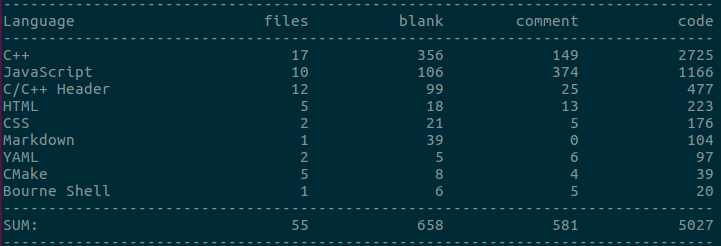
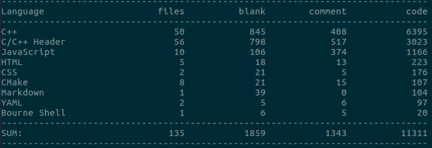

### 简述

> C10K+、多线程、高性能，高可靠，可维可测
>
> 

#### [核心]

> **静态web页面、CGI、心跳监控服务器**  
> **epoll+主从loop+线程池**、**异步日志**  
> **http1.1 GET/POST/Pipeline**、**fastcgi**, 涉及 **nginx/redis/mysql**  
> **线程心跳**、**websocketd**、**prometheus+alertmanager+grafana+dingtalk**  


#### [架构]

  


**PS**:本项目的重点不在数据库，而在上游的web静态和FastCGI服务器集群 -- 它们是无状态的服务，所以就没有涉及到主从复制、存储分片、网络分区、容错、故障恢复和共识选主等有状态服务的高可用保障的设计。

#### [业务]

> 业务流程: 主页->注册(各种checker)->登陆->登陆成功(y/n)

#### [压测]

> 在单台多核主机上，IO线程size=2，业务线程池size=5，用wrk和apache ab分别压index.html(2kB)：
> (不连接redis)

```shell
1、ab -k -c 100 -n 10000 http://127.0.0.1:1688/
2、./wrk -t3 -c100 -d10s -H "Connection: keepalive" "http://localhost:1688/"
```

> ***QPS > 36K req/s，吞吐量 >40MB/s, 响应时长 3.6ms(99%)***

#### [video]<a href="https://zlonqi.gitee.io/2020/02/11/lonky-pretty-server/"></a>

#### [cloc]

```bash
 cloc -exclude_dir="base,tcpSocket,log,lib" .#exclude dir : base,tcpSocket,log,lib
```



```bash
 cloc -exclude_dir="log,lib" .#include dir base,tcpSocket
```



#### [detail]

> 1、redis 是**线程单例的长连接，该连接和心跳一样，都能自行断线重连，自动切换，可靠可用**  
> 2、若文件需要放redis中，path+filename用md5进行哈希作为key，文件内容进行zip压缩作为value，**md5和zip编解码器均为线程单例**  
> 3、文件采用**分块发送**策略，保证了所需的发送缓冲区和文件大小无关，极大节约内存资源  
> 4、忽略**SIGPIPE**，对**SIGINT\SIGTERM**设置回调函数，保证整个服务器能够安全有序地终止和析构  
> 5、为每个连接生成全局唯一的**requestID**，于进入函数体伊始打印log时附上此requestID，有利于日志分析和程序排错  
> 6、gcc/g++开启 **-fsanitize=address -g** 选项以检测内存问题、shell打开生成**coredump**有利于多线程程序复现崩溃现场环境  
> 7、CPU性能分析工具--**perf+火焰图**，找出性能瓶颈  


### MORE

##### [usuage]

```bash
cd bin
./run  								#staticWebServer :1688,websocketd :8000,monitor:8001
./cgiServer ~/PATH/fastcgi/config.yaml           #fastcgiServer :16888
./HeartBeatChecker 							#heartBeatMonitor :8088
```

#### [configuration]
###### ~/webServer/config.yaml

```yaml
webServer:
 ...
  poolThreads: 1 #业务线程池
  loopThreads: 1 #IO线程池
  maxConnections: 10170 #最大连接数
  connIdleTime: 30 #连接最大空闲时长
  aliveTime: 300 #服务器TTL，测试用
...
log:
  ...
  maxSize:	#按size
    G: 0
    M: 200
    ...
  rollTime:	#按时间
    zoneTime: 8 #东8区
    hour: 13
   ...
  IOFrequency: 3
heartBeat:
  switch: on #心跳开关
  ...
  frequency: 5 #线程轮流发送心跳时间间隔
redis:
 ...
  vip:	#very important page，类似于布隆过滤器
    1: /myProjectPath/webServer/index.html
  rate: 0.6	#压缩率
zlibMap:
  592A11E79283991D4ED33D2086DF77AE: 1771 #文件md5值和对应的原文件大小
```

###### ~/cgiServer/config.yaml

```yaml
...
#DataBase Configuration
dataBase:
  ...
heartBeat:
  ...
  frequency: 5
...
```

#### [reference]

> github.com/chenshuo/muduo  
>
> github.com/tencent-wechat/libco

##### [fixed on muduo]

> 0、添加base/threadPool.h ,实现了线程单例HttpParser(内含redis长连接、md5和zip编解码器)  
> 1、优化了日志滚动可选项：可配置按需滚动：按大小滚动、按时间点滚动  
> 2、优化了服务端 TCP断开4次挥手，使得被动断开也会先清空应用层发送缓冲区再发送FIN包来结束4次挥手，踢掉空闲链接则直接发送RST强行立刻终止  

#### [Contributor]

<a href="https://zlonqi.gitee.io/"></a>

### NEXT...
#### C10M ：Share-nothing、zero-copy、Asynchronous programming、kernel bypass
